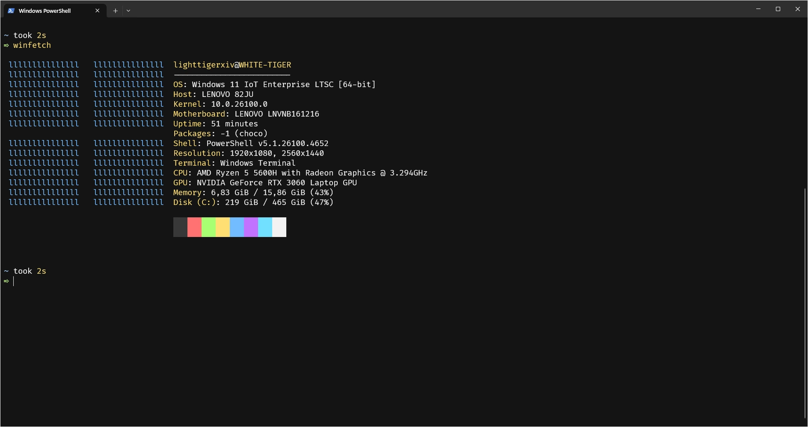
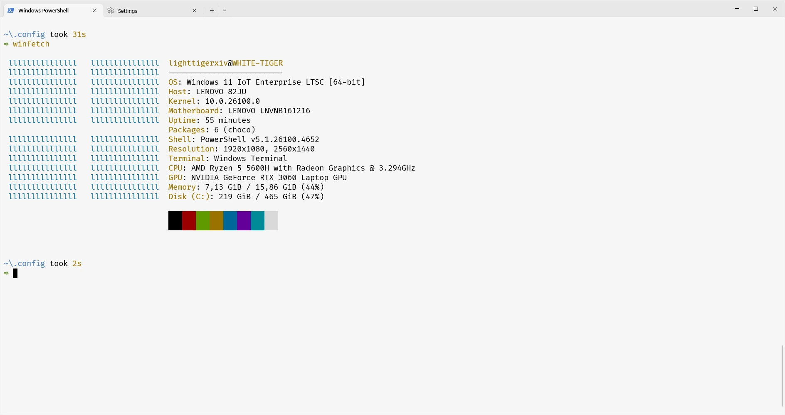

  

  # Mono Code for Windows Terminal

  

      
      
  

# Install
1. Copy the json contents of the theme.
    - [Panther](./src/panther.json)
    - [Lynx](./src/lynx.json)

2. Open Windows Terminal

3. Go to settings or run `ctrl + ,`

4. Click on the "Open JSON file" button

5. Paste the theme in the schemes array and save

6. On windows terminal, go to `Defaults`->`Appereance`->`Color Scheme` and select the theme

7. Save and enjoy your themed terminal :P

# Maintainers
🐈‍⬛ lighttigerXIV
